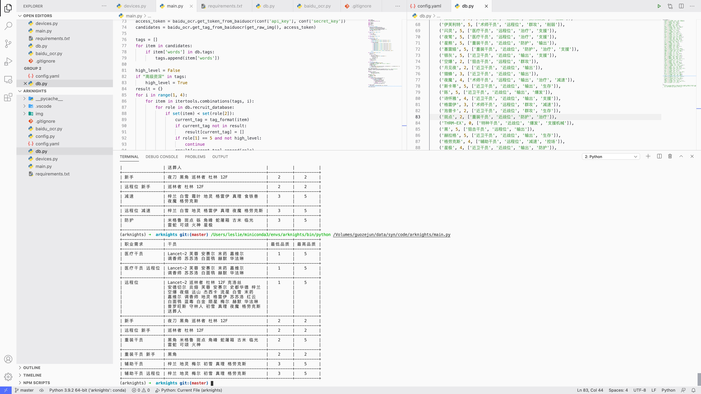

# 明日方舟自动公开招募tag识别



## 功能

自动识别公开招募tag，给出招募建议

## Requirement

- adb >= 31.0.1
- python >= 3.9.2
- pip >= 21.0.1

## 安装

```zsh
pip install -r requirements.txt
```

## 使用

1. Android平台终端以开发者模式连接到PC或Mac
2. 进入明日方舟公开招募界面
3. 运行main.py脚本

## TODO

- 优化Tag识别范围
- 提升识别速度
- 编写CLI程序，优化操作体验
